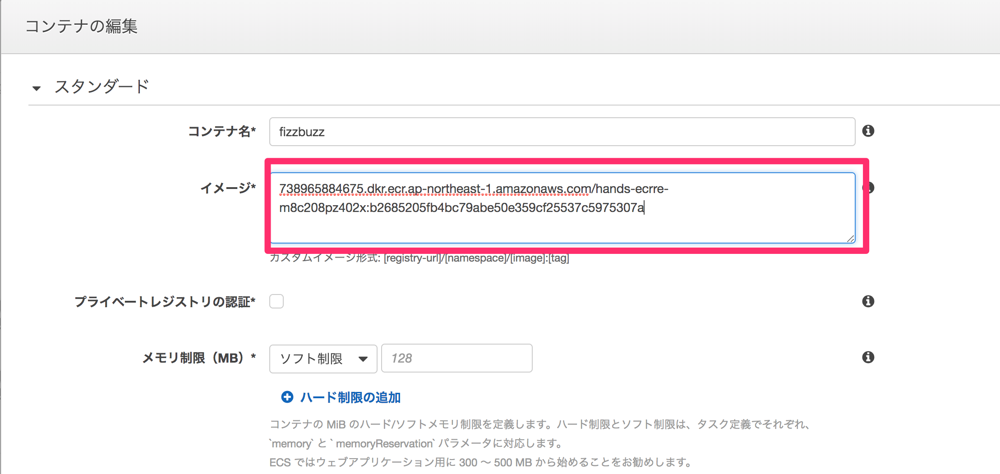
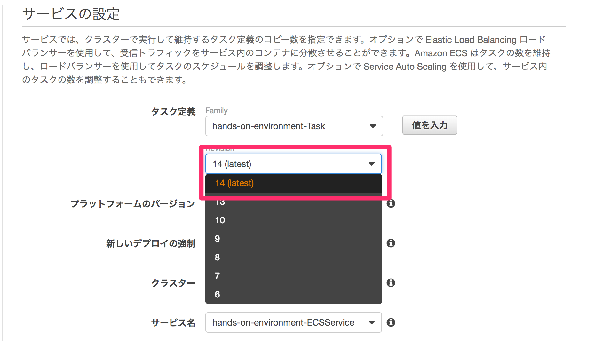

## 手動デプロイしてみる（講師が実演します。読み飛ばし可）

ecs-deploy のようなデプロイに便利なツールもありますが、CodeBuild で行う処理との対比をわかりやすくするため、ここではそういったものは使わずにデプロイを実行します。

まずはデプロイされたことがわかりやすくするため、画面を修正します。

```shell
npm install
vim template/views/index.ejs
npm test
git commit -am "manual deploy"
```

つぎに以下のコマンドを実行し、手動でデプロイを実行します。

まず、手元で Docker イメージを構築し、ECR にプッシュします。

```
$(aws ecr get-login --no-include-email --region ap-northeast-1)

IMAGE_REPOSITORY_NAME=`aws ssm get-parameter --name "IMAGE_REPOSITORY_NAME" --region ap-northeast-1 | jq -r .Parameter.Value`
IMAGE_TAG=`git rev-parse HEAD`
docker build -t $IMAGE_REPOSITORY_NAME:$IMAGE_TAG .
docker push $IMAGE_REPOSITORY_NAME:$IMAGE_TAG

echo $IMAGE_REPOSITORY_NAME:$IMAGE_TAG
```

ECS の設定の修正で使用するため、イメージをプッシュしたリポジトリとタグの値を覚えておきます。

ここまでの操作の中でも、プッシュする対象とは異なるブランチで作業を行っていた場合や、リモートブランチとの同期を忘れるなどした場合には意図したものとは異なるソースコードをデプロイしてしまうリスクがあります。

つぎに、コンソールの操作に移り、実際に ECS へのデプロイを行っていきます。

マネジメントコンソールから ECS の画面に移動します。


まず、タスク定義の新しいリビジョンを作成します。

環境構築用スタックによって作成されたタスクの新しいリビジョンの作成画面を表示します。
コンテナ名 fizzbuzz の設定画面に移動し、イメージの指定を先程プッシュしたイメージのものに書き換え新しいリビジョンを作成します。



次に、環境構築用スタックによって作成されたサービスの編集画面に移動し、新しいタスク定義のリビジョンを指定するように編集をおこない、サービスの更新を実行します。



しばらくすると新しいタスク定義に基づくタスクが実行され、コードの修正が反映されます。
