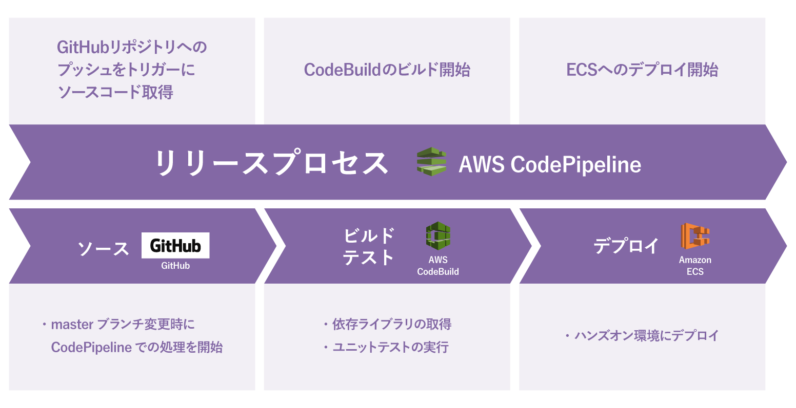

# 全体構成

今回は上記の図のような構成を構築します。

デプロイの流れとしては以下のようになります。

- GitHub にコードがプッシュされると CodePipeline での処理が開始されます。
- CodeBuild ではテスト、Docker イメージの作成および作成したイメージの ECR へのプッシュを行います。
- CodeBuild での処理が成功したら ECS に新しいバージョンのイメージがデプロイされます。