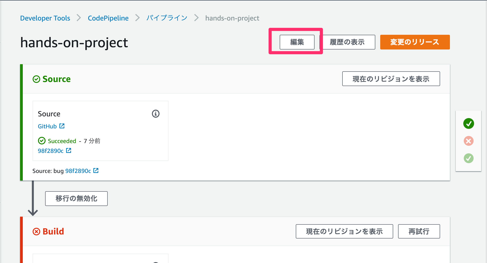
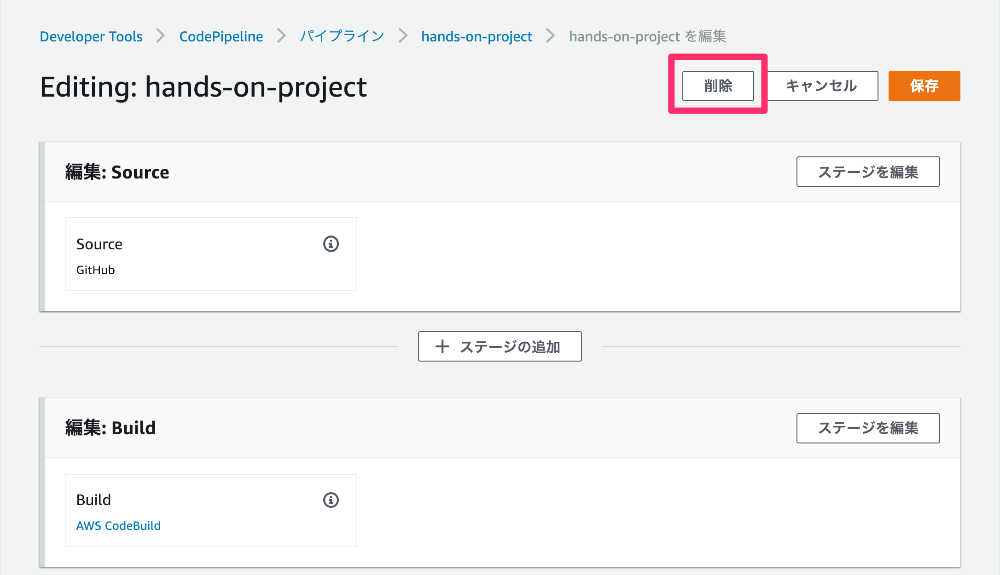

# 補足。 環境の削除

ハンズオンで作成した環境を削除したい場合は以下の手順を参考にしてください。
リソース間の依存関係がある関係で削除に失敗することがあるため、
CloudFormationスタックおよびクローンしたGitHubのリポジトリは最後に削除を行ってください。

## AWS

### CodePipelineのパイプラインの削除

パイプラインの画面から編集ボタンをクリックします。

表示された編集画面で削除ボタンをクリックし、表示された確認ダイアログにパイプライン名`hands-on-pipeline`を入力して削除します。

### CodeBuildのプロジェクトの削除

CodeBuild　の画面から、プロジェクト`hands-on-project`を選択した状態で、アクションのドロップダウンリストから削除をクリックします。

### CodePipelineのアーティファクト保存用S3バケット削除

`codepipeline-ap-northeast-1-****`バケットの中身を確認します。

もし、`hands-on-xxx` のフォルダだけしかなければ、バケット自体を削除します。

他のフォルダがあれば、フォルダ以下を削除します。

### ECRリポジトリ内のイメージをすべて削除

ECSの画面の左側にある、リポジトリのリンクをクリックし、`hands-***`という名前のリポジトリの画面の移動します。

そして、すべてのイメージを選択し、削除を行います。リポジトリ自体は削除しなくても大丈夫です。

### CloudFormationスタックの削除

CloudFormationのコンソールから、`hands-on-environment`という名前のスタックを選択し、削除します。

### hands-on-task-definitionの登録を解除

ECSの画面の左側にある、タスク定義のリンクをクリックし、`hands-on-environment-****`という名前のタスク定義の画面に移動します。

すべてのタスク定義を選択し、登録解除します。

## GitHub

### クローンしたリポジトリの削除

フォーク先リポジトリのSettingを開きます。

一番下のDelete this Repositoryというボタンをクリック、確認ダイアログにリポジトリ名を入力して削除します。
