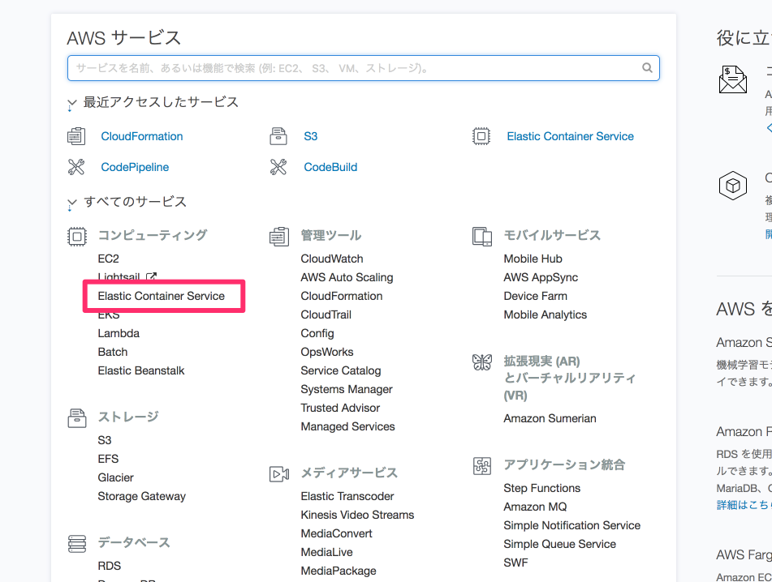
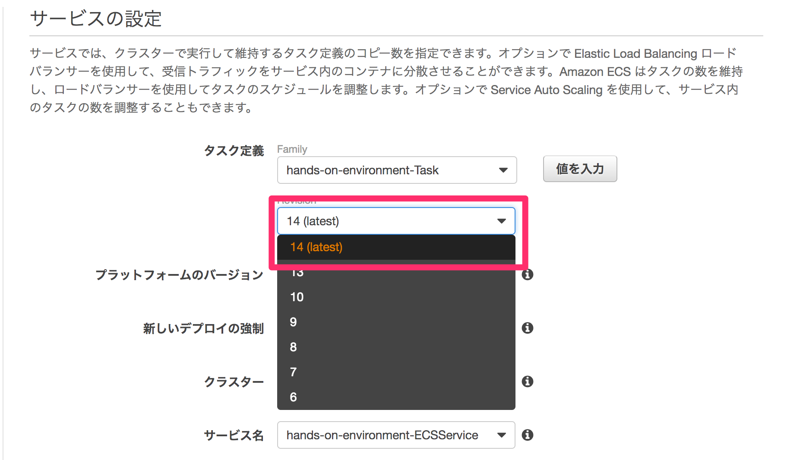

# 手動デプロイしてみる

**イベントでは講師が実演します。このページを読み飛ばして次に進むことも可能です。**

## ローカルで変更をコミット

`ecs-deploy`のようなデプロイに便利なツールもありますが、CodeBuildで行う処理との対比をわかりやすくするため、ここではそういったものは使わずにデプロイを実行します。

今回は画面に修正を行ったものをデプロイしていきます。

以下のコマンドを実行し、コードを修正、変更内容をコミットします。

```shell
npm install
vim template/views/index.ejs
npm test
git commit -am "manual deploy"
```

## Dockerイメージを作成し、ECRにプッシュ

つぎに以下のコマンドを実行し、手動でデプロイを実行します。

まず、手元でDockerイメージを構築し、ECRにプッシュします。

```
$(aws ecr get-login --no-include-email --region ap-northeast-1)

IMAGE_REPOSITORY_NAME=`aws ssm get-parameter --name "IMAGE_REPOSITORY_NAME" --region ap-northeast-1 | jq -r .Parameter.Value`
IMAGE_TAG=`git rev-parse HEAD`
docker build -t $IMAGE_REPOSITORY_NAME:$IMAGE_TAG .
docker push $IMAGE_REPOSITORY_NAME:$IMAGE_TAG

echo $IMAGE_REPOSITORY_NAME:$IMAGE_TAG
```

ECSの設定の修正で使用するため、イメージをプッシュしたリポジトリとタグの値を覚えておきます。

ここまでに行ったローカルの作業でも、意図したものとは異なるソースコードをデプロイしてしまうリスクがあります。

- プッシュする対象とは異なるブランチで作業を行っていた場合
- リモートブランチとの同期を忘れるなどした場合には

## ECSのタスク定義の新リビジョン作成・サービスの更新

つぎに、コンソールの操作に移り、実際にECSへのデプロイを行っていきます。

マネジメントコンソールからECSの画面に移動します。



まず、タスク定義の新しいリビジョンを作成します。

環境構築用スタックによって作成されたタスクの新しいリビジョンの作成画面を表示します。
コンテナ名fizzbuzzの設定画面に移動し、イメージの指定を先程プッシュしたイメージのものに書き換え新しいリビジョンを作成します。


次に、環境構築用スタックによって作成されたサービスの編集画面に移動します。
この画面で、新しいタスク定義のリビジョンを指定するように編集をおこない、サービスの更新を実行します。



しばらくすると新しいタスク定義に基づくタスクが実行され、コードの修正が反映されます。

コンソールでの作業も頻繁なデプロイを敬遠したくなる程度には煩雑でした。
