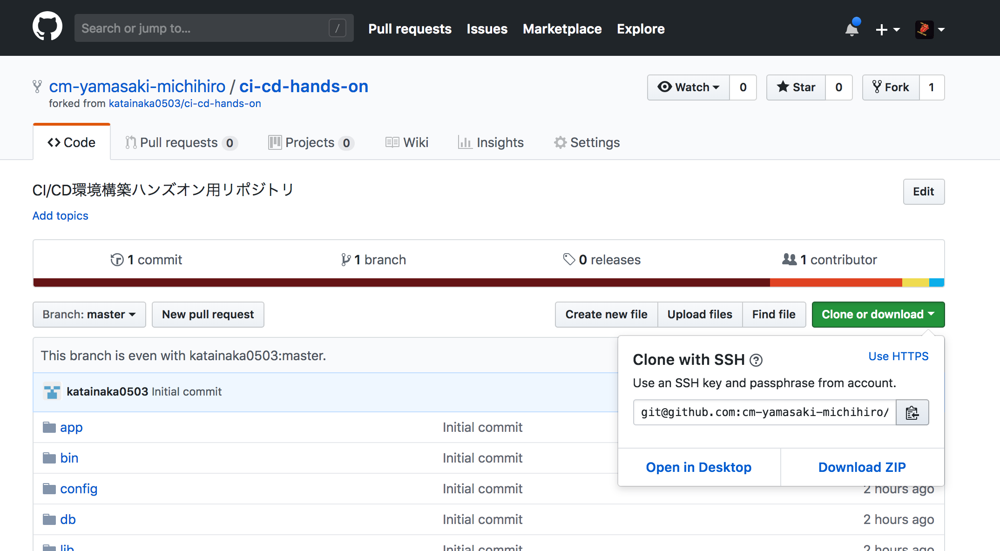
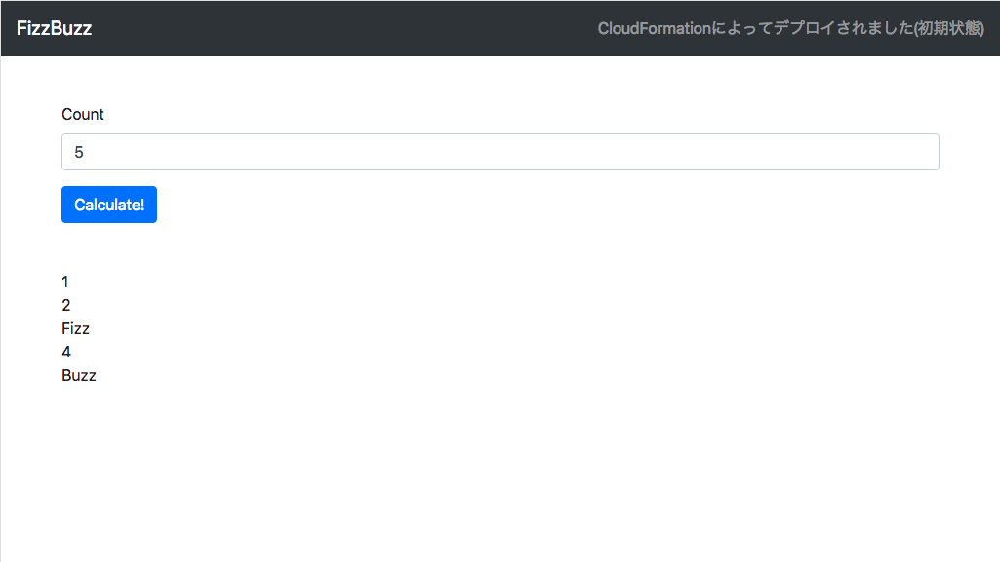

# 準備

## サンプルアプリケーションのフォークおよびクローン

まずは、[このリポジトリ](https://github.com/classmethod/ci-cd-hands-on-ecs)をフォークし、自分のアカウントにリポジトリを作成します。

サンプルアプリケーションは、指定された数まで FizzBuzz を表示する Node.js による簡単なアプリケーションです。


上のリンクから GitHub の当該リポジトリのページに移動し、右上の `Fork` というボタンからフォークを実行します。



自分の GitHub アカウント上に作成されたフォークしたリポジトリから、ローカルの PC にクローンします。作業用のディレクトリで以下のコマンドを実行します。

```shell
$ git clone git@github.com:<ご自分のgithubのアカウント名>/ci-cd-hands-on-ecs.git
```

クローンされたリポジトリのディレクトリに移動して中身を確認し、クローンが正しく行われたことを確認します。

```shell
$ cd ci-cd-handson-ecs
$ ls
Dockerfile		cloudformation		package.json
README.md		docs			src
buildspec.pr.yml	mkdocs			template
buildspec.yml		package-lock.json	test
```

## ECSのServiceLinkedRole作成

今回 ECS でアプリケーションを動作させるにあたってサービスにリンクしたロールが作成されている必要があります。そのため、IAM のコンソールを開き、`AWSServiceRoleForECS`というロールがあるかを確認してください。ない場合はサービスにリンクしたロールがない状態ですので、ECSのタスクの実行が失敗してしまいます。

その場合は、以下のコマンドを実行してECSのサービスにリンクしたロールが作成された状態にします。

```shell
aws iam create-service-linked-role --aws-service-name ecs.amazonaws.com
```


## ハンズオン用環境構築用の CloudFormation の実行

[](https://ap-northeast-1.console.aws.amazon.com/cloudformation/home?region=ap-northeast-1#/stacks/quickcreate?stackName=hands-on-environment&templateURL=https://s3-ap-northeast-1.amazonaws.com/ci-cd-hands-on-template/node/hands-on-environment.yaml)

上のリンクより、ハンズオン用の環境を構築するための CloudFormation を実行します。

この、CloudFormation によって、以下の図のような構成の環境が作成されます。


アプリケーションの動作環境以外に後で CodeBuildとCodePipeline で使用するための IAM Role を作成しています。

作成したスタックが `CREATE_COMPLETE` の状態になるまで待ちます。

## 動作確認

作成したスタックの出力に`ALBDNSName`というキーで出力された値が、今回のサンプルアプリケーションのアクセス先の URL です。アドレスバーにコピペして、サンプルアプリケーションの動作を確認します。

