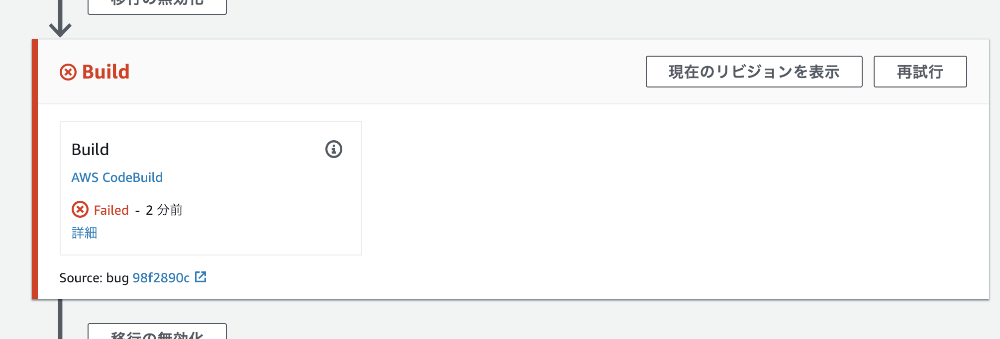

# テスト失敗時にデプロイが止まることを確認

バグが混入した際に、テストで処理が失敗し、デプロイが途中で止まることを確認するため、フォークしたリポジトリのコードを修正します。

エディタで FizzBuzz のロジックが記述されているファイル、`src/model/fizzbuzz.js`を開きます。

意図的にバグを混入させるためコードを修正します。

```
if (i % 15 == 0) {
```

上に示した行を以下のように修正します。

```
if (i % 10 == 0) {
```


修正が終わったらコミットし、GitHub 上にプッシュします。

```shell
git commit -am bug
git push origin master
```

GitHub にプッシュすると、CodePipeline での処理が開始されます。
しかし、CodeBuild でテストが失敗し、ECS へのデプロイは実行されません。



テストが自動で実行される環境が構築されていたため、バグの混入したバージョンがデプロイされるのを防ぐことができました。